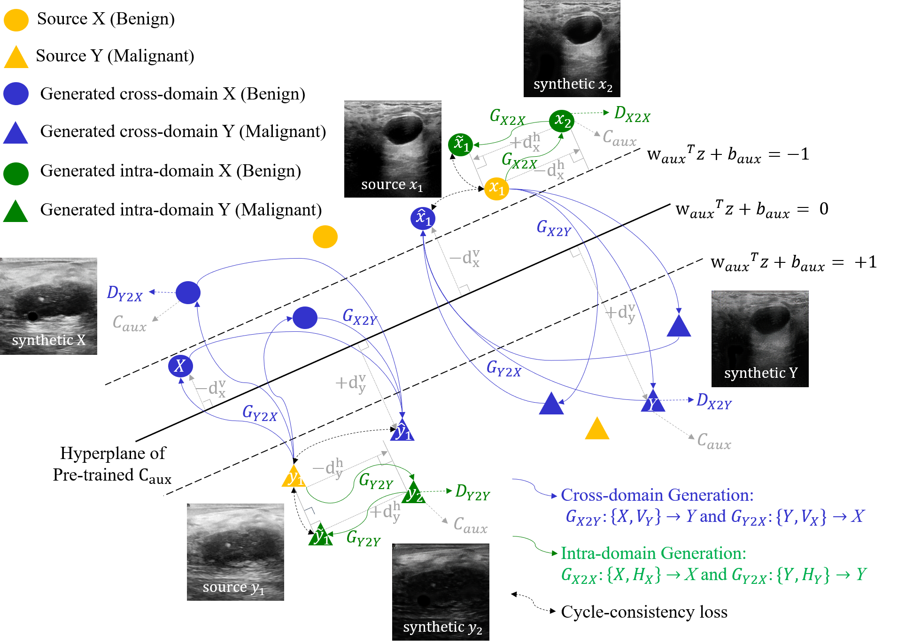
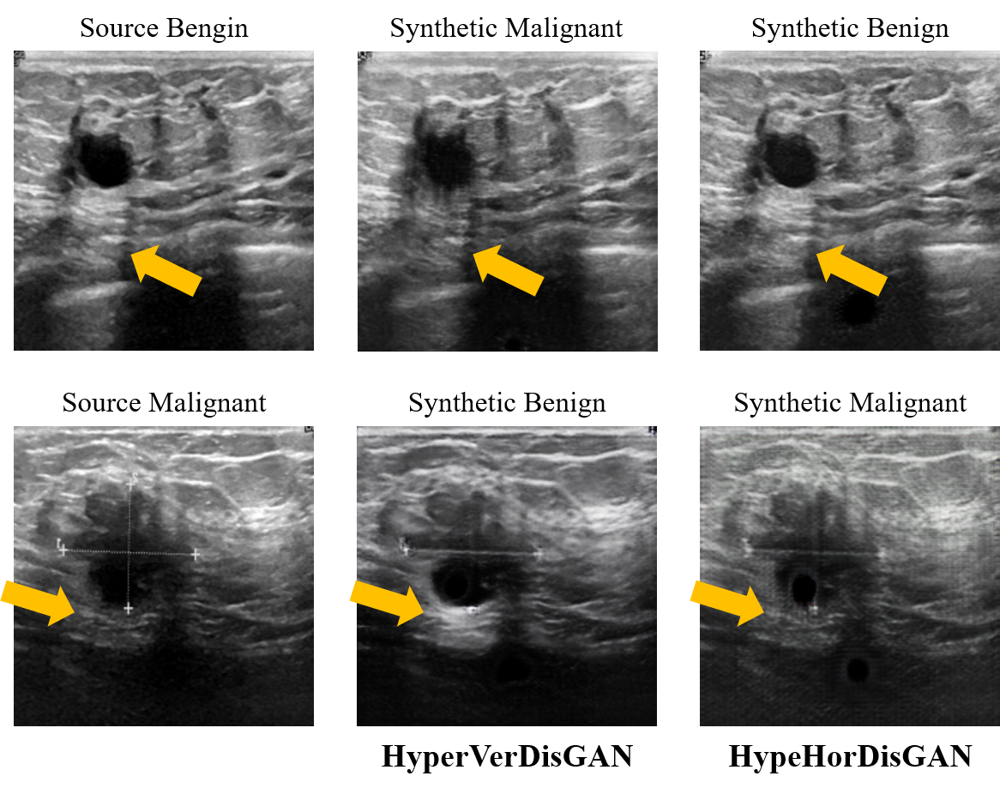
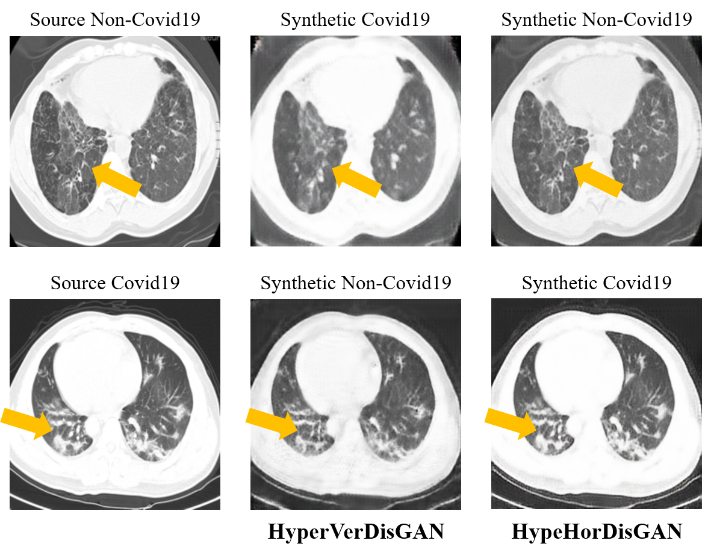
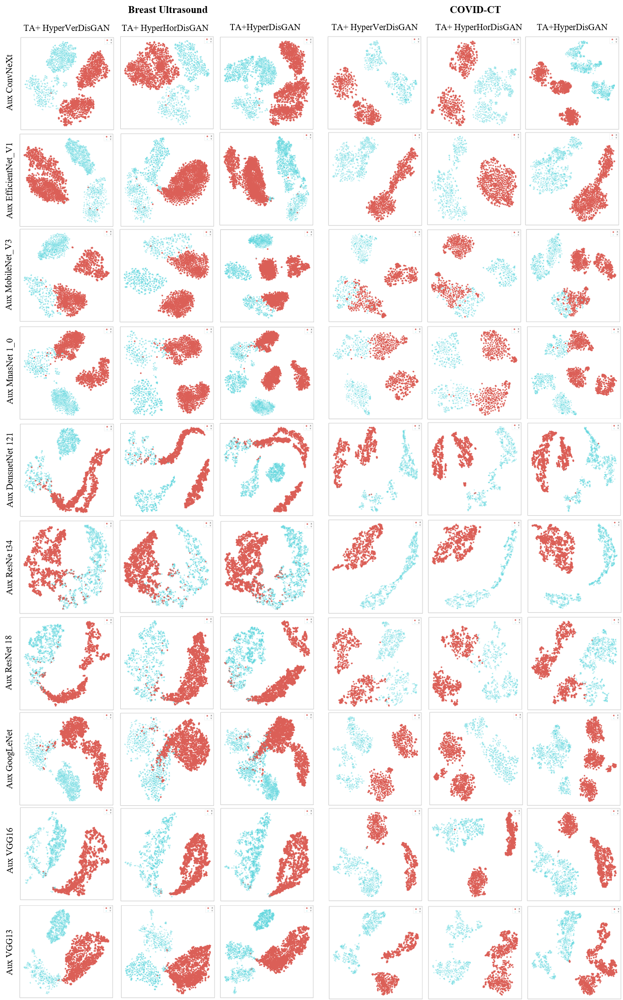

# Introduction
Conventional transformation methods primarily rely on the intra-domain knowledge. On the other hand, advanced generative adversarial networks generate cross-domain images lacking variety, particularly in small-scale datasets. In light of these challenges, we propose that accurately controlling the variation degrees of synthetic samples can reshape the decision boundary in hyperplane space for the downstream classifications.

We developed a HyperDisGAN effectively controlling the locations of generated cross-domain and intra-domain samples. The locations are respectively defined using the vertical distances of the cross-domain samples to the optimal hyperplane and the horizontal distances of the intra-domain samples to the source samples, which are determined by Hinge Loss and Pythagorean Theorem.



# Example of HyperDisGAN generation
**#--------------------Breast Ultrasound--------------------# #-----------------------COVID-CT-----------------------#**
<p align='left'>


</p>

# Training samples' distribution
- Ten auxiliary classifiers used in the HyperdisGAN


# Prerequisites
- Linux or Windows
- Python 3.8+
- NVIDIA GPU + CUDA CuDNN
- anaconda virtual environment
  ```
  conda install pytorch torchvision torchaudio pytorch-cuda=11.7 -c pytorch -c nvidia  
  
  conda install tqdm  
  
  conda install matplotlib==3.3.4  
  
  conda install seaborn  
  
  conda install scikit-learn  
  ```

# Datasets
```
covid_ct：
├─train├─X
│      │  001non-covid19.png
│      │  002non-covid19.png
│      │  003non-covid19.png
│      ├─Y
│      │  001covid19.png
│      │  002covid19.png
│      │  003covid19.png
├─valid├─X
│      │  001non-covid19.png
│      │  002non-covid19.png
│      │  003non-covid19.png
│      ├─Y
│      │  001covid19.png
│      │  002covid19.png
│      │  003covid19.png
├─test ├─X
│      │  001non-covid19.png
│      │  002non-covid19.png
│      │  003non-covid19.png
│      ├─Y
│      │  001covid19.png
│      │  002covid19.png
│      │  003covid19.png
```

# Running command
```
python train.py --cuda  --dataset_name covid_ct --project_name cyclegan_convnext_tiny --aux_classfier pretrained_aux_convnext_tiny.pth
--model_name convnext_tiny --lambda_vertical 0.01 --lambda_horizontal 0.01
```

```
python test.py --cuda  --dataset_name covid_ct --project_name cyclegan_convnext_tiny --aux_classfier pretrained_aux_convnext_tiny.pth
--model_name convnext_tiny --classifier downstream_convnext_tiny.pth
```
